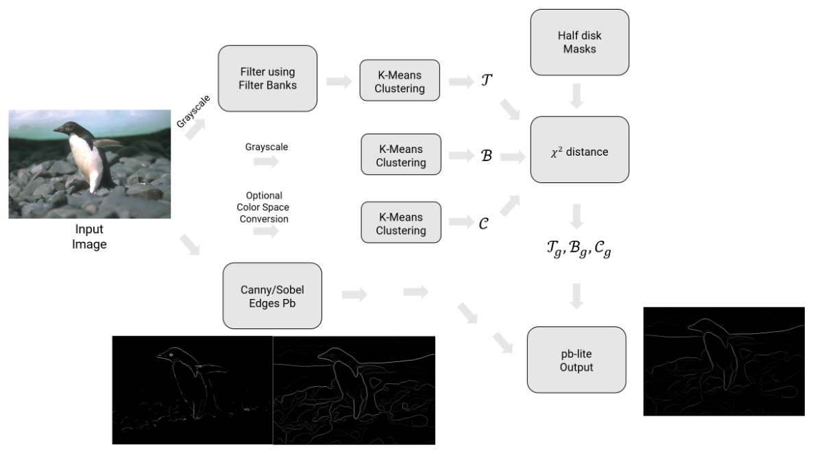
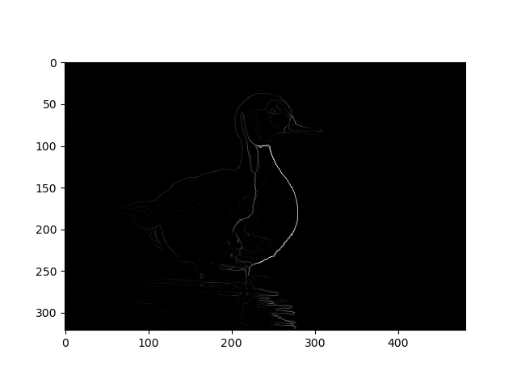

# Probability-based Edge Detection (Pb-Lite)

### Overview

Edge detection, though well explored, is still not a completely solved or optimized task. Since edges in an image are subjective and can be examined through changes in depth, texture, brightness, and color, it is often observed that even well-known edge detection techniques fail to discover all relevant edges or add redundant/noisy edges to many image styles. This leads to the motivation to use techniques that use a combination of different baselines. The premise of this project is to explore probability-based edge detection, described in detail on [this webpage](https://cmsc733.github.io/2022/hw/hw0/). Computing the PbLite edges uses gradients in texture, brightness, and color to assign probabilities to the presence of an edge detected by Canny and Sobel edge detection baselines. The following sections go over the various steps used in this pipeline tested on ten sample images to evaluate performance. A high-level overview of the overall process is shown below.

  

### Filter Banks

The first step in generating the gradients in the image texture is obtaining a set of filters called the filter bank, which collectively work to obtain different texture features on convolving with the grayscale version of the original image. The various filters used to make the filter bank are described in the following subsections.

#### Derivative of Gaussian (DoG) Filters

The basic filters used in edge detection include the DoG Filter which is obtained by convolving a Gaussian Filter (which smooths the image) with Sobel Filters (which calculates intensity gradients in the horizontal and vertical directions). By rotating the basic DoG filter to different orientations at different filter sizes and scales (standard deviation of the Gaussian smoothing function on a pixel scale), we get a set of oriented DoG filters that are useful in bringing about different scales of gradient changes in various directions of the image. A total of 32 oriented DoG Filters are used as shown below. Two scales, sigma = [2,3] and sixteen orientations (equally spaced angles starting from 0 radians) are used for generating the DoG Filters of size 21*21.

  

#### Leung-Malik (LM) Filters

The LM filter set contains 48 filters which consist of the first and second derivatives at six orientations (equally spaced angles starting at 0 radians) and three scales of a Gaussian Filter (36 filters), Laplacian of Gaussian (LoG) Filters at eight scales (8 filters), and simple Gaussian Filters at four scales. The scales used in these filters come from a set sigma = [sigma1, sigma2, sigma3, sigma4]. The first and second derivative of Gaussians use [sigma1, sigma2, sigma3], whereas the LoG filters use [sigma1, sigma2, sigma3, sigma4, 3sigma1, 3sigma2, 3sigma3, 3sigma4], and the Gaussian filters use [sigma1, sigma2, sigma3, sigma4]. For generating our filter bank for pb-lite, two sets of LM Filters are used, the Leunf-Malik Small (LMS) Filter Set using sigma_s = [1,$\sqrt{2}$,2,2 $\sqrt{2}$] and the Leung-Malik Large (LML) Filter Set using sigma = [$\sqrt{2}$,2,2 $\sqrt{2}$,4], making a total of 96 filters (of size 21*21), as can be seen below.

  

#### Gabor Filters

A Gabor Filter is a Gaussian Filter modulated by a sine wave at different frequencies and orientations. It is based on the human visual system and targets specific frequency variations in the texture of an image. Six orientations (equally spaced angles starting at 0 radians), two scales (sigma = [10,25]), and three frequencies (f = [2/N,3/N,4/N], where N=21 is the filter size) are used to generate the set of Gabor Filters shown below.

  

### Texton, Brightness, and Color Maps

#### Texton Maps

The texton map contains various texture properties of the image and can be obtained by convolving all the filters in the filter bank with the grayscale version of the image to get a new set of images, equal in number to the number of filters in the filter bank, each with dimensions equal to the original image. This can be visualized as each pixel of the grayscale image corresponding to a set of features of dimension equal to the number of filters. Using K-Means clustering with 64 clusters and two initialization runs, we can assign a specific cluster/bin to each pixel of the original image that is called the texton map. The texton maps of some of the images are shown below.

  

  

  

#### Brightness Maps

Just as we obtained the texton map, we can also generate the brightness map that contains brightness properties within the grayscale image. To do this, we follow a similar procedure to generating the texton map, except that we don't apply the filter banks and use one-dimensional information (grayscale pixel intensity value) to do K-Means clustering with 16 clusters/bins. The brightness maps of some of the images are shown below.

  

  

  

#### Color Maps

Similar to the brightness map, a color map displaying the color properties of an image can be obtained by performing a similar K-Means clustering operation with 16 clusters/bins on the original RGB image, thus using three-dimensional features for each pixel. The color maps of some of the images are shown below.

  

  

  

### Map Gradients

Upon generating the three (texton, brightness, and color) maps, it is important to calculate their gradients as the gradients in each of those properties are what contribute to the presence of an edge in the image. The gradients of the maps (texton, brightness, and color) can be smartly computed by convolving half-disk filters/masks in pairs of opposite orientations over the map. The half-disk filters are generated at a filter size of 21*21, and radii of r=[2,5,10,20,30]. The set of half-disk filters/masks used can be seen below.

  

The chi-square distance between the images is obtained by convolving each half-disk mask of a pair is calculated over all the clusters/bins of the map, summed up for all half-disk mask pairs, and averaged for each pixel to get a two-dimensional gradient map with the same shape as the original map. This operation is done for all three (texton, brightness, and color) maps. The texton, brightness, and color map gradients maps (in this order) of one of the images are shown below.

  

  

  

### Pb-Lite Outputs

Using the gradient maps of each of the three (texton, brightness, and color) maps along with the Canny and Sobel baseline outputs, we can calculate the probability-based edge detection (pb-lite) output using a Hadamard operator. The net baseline used can be adjusted by weighting the Canny and Sobel baselines. Using a weight of 0.5 for each works well for a general-purpose edge detection task. We can also add weight to the texton, brightness, and color maps. Using an average of the three for each pixel works well in this scenario too. The Canny baseline, Sobel baseline, and generated Pb-lite images are compared and shown next to each other below for some of the images.

  

  

  

***********************************************************************************************************

You can refer to more pb-lite and intermediate step outputs in the `Code/results` directory as well as more mathematical and implementation details in `Report.pdf`.

This project was made possible with the guidance and support of Dr. Yiannis Aloimonos from the University of Maryland. The images for the workflow were taken from [this](https://cmsc733.github.io/2022/hw/hw0/) webpage.
